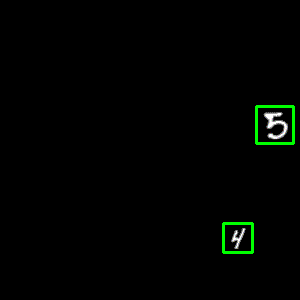

# Object Detection over Augmented MNIST
Object detection over Augmented MNIST dataset in tensorflow

## Augmented MNIST Dataset
* create the dataset using ```python3 create_dataset.py``` (change the values of the ```train_data_size``` and ```test_data_size``` variables accordingly)
* This should create 4 files place them in the ```"./data"``` folder

### Data Visualisation
* Run the data_vis.py after data creation to visualize the dataset
* It creates a short gif as shown below



